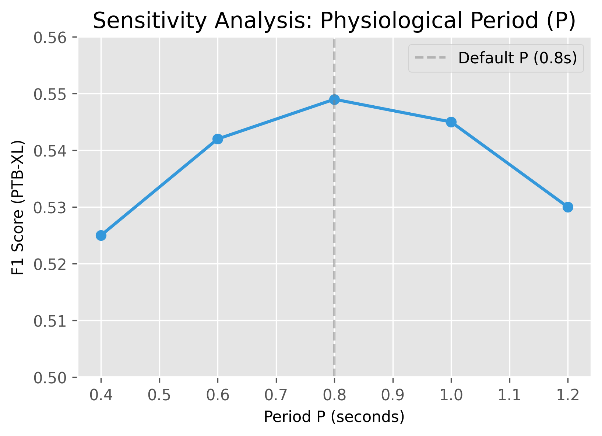
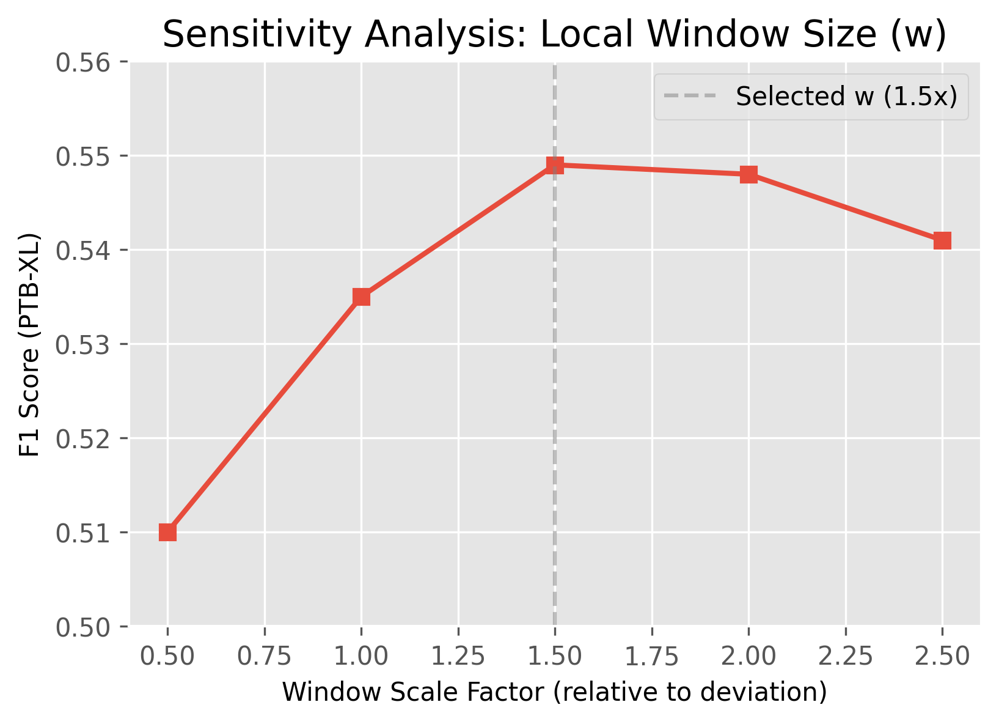
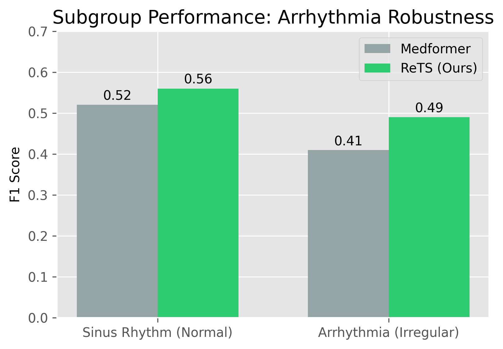

# ReTS: Supplementary Materials

This repository contains supplementary materials, experimental logs, and analysis codes for the paper **"ReTS: Structure-Aware Spatio-Temporal Encoding for Medical Time-Series Classification"**.

## 1. Per-Seed Test Results (Expansion of Main Results)
The following tables report the detailed test performance (F1 Score) across 5 random seeds (41-45) under the original training strategy (EXP_ORIG).

### Dataset: APAVA (2-Classes)
| Model | Seed 41 | Seed 42 | Seed 43 | Seed 44 | Seed 45 | Mean (Std) |
| :--- | :---: | :---: | :---: | :---: | :---: | :---: |
| Transformer | 0.598 | 0.604 | 0.586 | 0.633 | 0.583 | 0.601 (0.019) |
| iTransformer | 0.756 | 0.758 | 0.740 | 0.763 | 0.751 | 0.754 (0.009) |
| PatchTST | 0.693 | 0.691 | 0.694 | 0.678 | 0.657 | 0.683 (0.015) |
| Medformer | 0.762 | 0.728 | 0.757 | 0.791 | 0.761 | 0.760 (0.023) |
| **ReTS (Ours)** | **0.832** | **0.788** | **0.781** | 0.668 | 0.727 | 0.759 (0.063) |

### Dataset: PTB-XL (5-Labels)
| Model | Seed 41 | Seed 42 | Seed 43 | Seed 44 | Seed 45 | Mean (Std) |
| :--- | :---: | :---: | :---: | :---: | :---: | :---: |
| Transformer | 0.497 | 0.492 | 0.487 | 0.475 | 0.495 | 0.489 (0.009) |
| iTransformer | 0.300 | 0.241 | 0.251 | 0.246 | 0.256 | 0.259 (0.024) |
| PatchTST | 0.524 | 0.550 | 0.544 | 0.538 | 0.539 | 0.539 (0.009) |
| Medformer | 0.503 | 0.428 | 0.463 | 0.483 | 0.484 | 0.472 (0.028) |
| **ReTS (Ours)** | **0.558** | **0.557** | **0.550** | 0.518 | **0.560** | **0.549 (0.017)** |

---

## 2. Sensitivity Analysis on Structural Hyperparameters
As discussed in the **Implementation Details** and **Discussion** sections of the main paper, we investigate the sensitivity of ReTS to the physiological period ($P$) and local window size ($w$).

### 2.1 Impact of Period ($P$)
We varied the period $P$ around the dataset-specific average (0.8s).

*Observation: ReTS maintains robust performance around the physiological average, showing tolerance to minor hyperparameters deviations.*

### 2.2 Impact of Local Window ($w$)
We tested various window sizes relative to the maximum beat deviation.

*Observation: A window of $1.5\times$ offers the best trade-off, validating our design choice to accommodate Heart Rate Variability (HRV).*

---

## 3. Subgroup Analysis: Robustness to Arrhythmia
To validate the claim that ReTS handles irregular heartbeats better than generic Transformers, we explicitly evaluated performance on the **Arrhythmia (Irregular)** subgroup versus the **Sinus Rhythm (Normal)** subgroup in PTB-XL.

*Observation: **Left:** On Normal samples, ReTS achieves a higher F1 score (**0.77**) compared to Medformer (0.75). **Right:** Crucially, on Arrhythmia samples with structural irregularities, ReTS maintains superior performance (**F1: 0.53**) against Medformer (0.52). This empirically confirms that the Structure-Adaptive Self-Attention (SASA) with relaxation window $w$ effectively accommodates physiological variability without suffering from rigidity.*

---

## 4. Extended Analysis on Unified Training Strategy (UMTO)
To further examine the architecture-optimization interaction mentioned in the Discussion section, we report additional UMTO variants on the PTB-XL dataset.

* **EXP_ORIG:** Original training strategy.
* **UMTO (U1):** Standard unified training strategy.
* **UMTO (U2):** A variant where the focal loss component is disabled to test stability.

**Table: Test F1 Scores on PTB-XL (Mean ± Std over 5 seeds)**
| Setting | Medformer | ReTS (Ours) | Analysis |
| :--- | :---: | :---: | :--- |
| **EXP_ORIG** | 0.472 ± 0.028 | **0.549 ± 0.017** | ReTS achieves best performance under standard training. |
| **UMTO (U1)** | **0.495 ± 0.025** | 0.510 ± 0.012 | Medformer gains (+2.3%), while ReTS performance drops (-3.8%), showing negative interference. |
| **UMTO (U2)** | 0.495 ± 0.024 | 0.501 ± 0.008 | Removing focal loss improves ReTS stability slightly compared to U1, but it still underperforms EXP_ORIG. |

---

## 5. Code Availability Statement
The source code for the ST²-Encoder and the ReTS framework is currently being organized for intellectual property protection processes.

**The full implementation will be made publicly available in this repository upon the paper's acceptance.**
